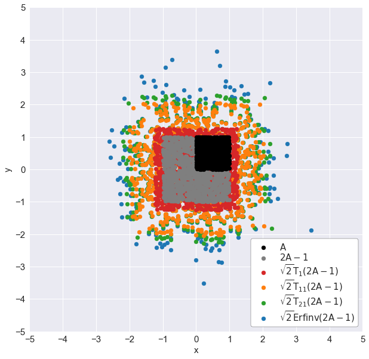

# How to generate Gaussian samples

Gaussian sampling—that is, generating samples from a Gaussian distribution—appears in many cutting-edge fields of data science, such as [Gaussian process](https://en.wikipedia.org/wiki/Gaussian_process), [variational autoencoders](https://en.wikipedia.org/wiki/Autoencoder#Variational_autoencoder_(VAE)), or [generative adversarial networks](https://en.wikipedia.org/wiki/Generative_adversarial_network).
As a result, you often see functions like [tf.random.normal](https://www.tensorflow.org/api_docs/python/tf/random/normal) in their tutorials. 

But, deep down, how does a computer know how to generate Gaussian samples? This project will show 3 different ways that we can program our computer (via Python) to do so. You will also see how R and Python generate Gaussian samples using modified versions of some of these methods.

## Project structure
* **Part 1:** Generate Gaussian samples using [inverse transform sampling](https://en.wikipedia.org/wiki/Inverse_transform_sampling): [code](notebooks/part1.ipynb), [write-up](https://medium.com/mti-technology/how-to-generate-gaussian-samples-347c391b7959?source=friends_link&sk=46282403d3478247812038bfa0d1febf)

* **Part 2:** Generate Gaussian samples using [Box-Muller transform](https://en.wikipedia.org/wiki/Box%E2%80%93Muller_transform): [code](notebooks/part2.ipynb), [write-up](https://medium.com/@seismatica/how-to-generate-gaussian-samples-3951f2203ab0?source=friends_link&sk=09051f3c6d74ca2cbc30462a93d1a7dc)

* **Part 3:** Generate Gaussian samples using [central limit theorem](https://en.wikipedia.org/wiki/Central_limit_theorem) and transform Gaussian samples to have any means, variances and covariance (coming soon)